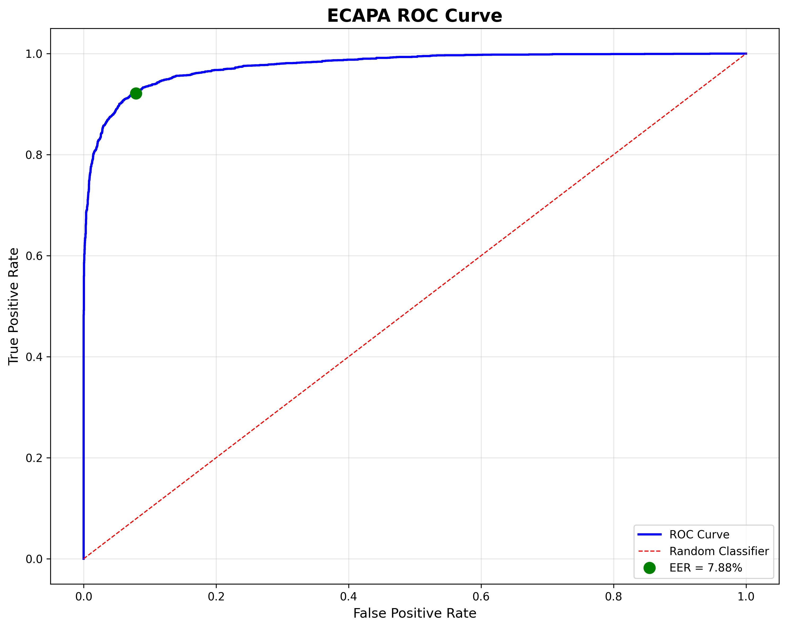
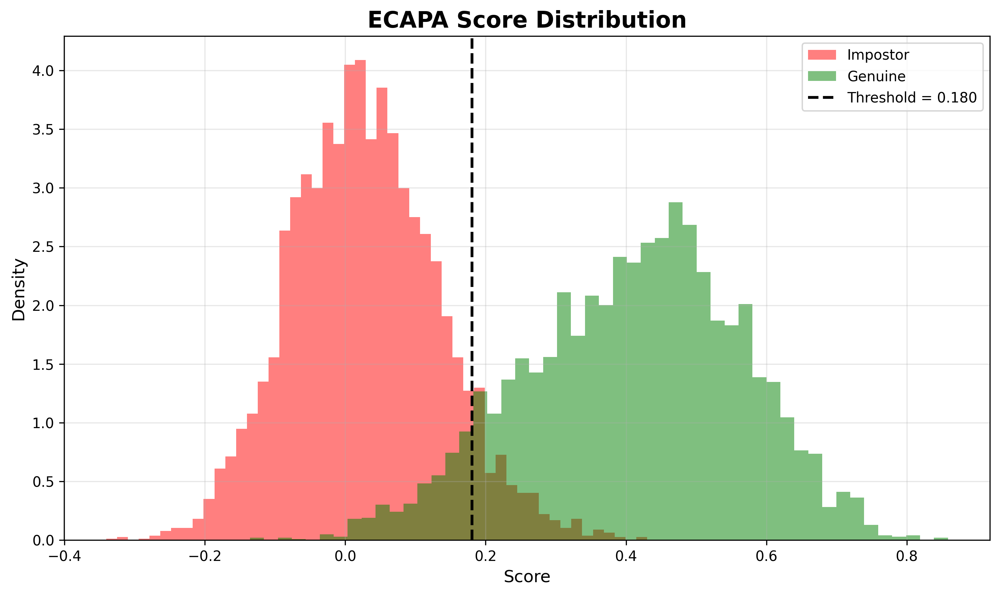
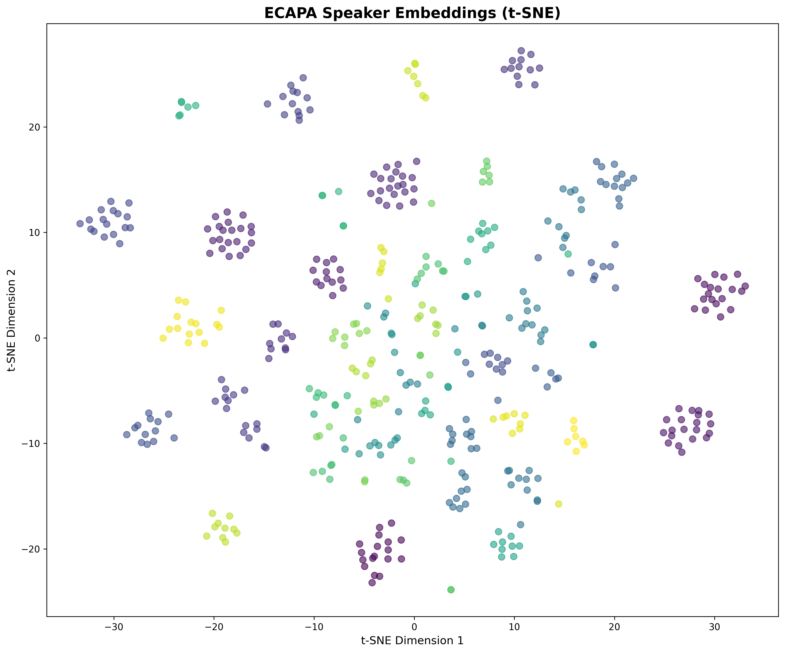

# Speaker Verification System for Regional Languages (Hindi & Kannada)

A deep learning-based speaker verification system implementing **ECAPA-TDNN** architecture for regional language (Hindi and Kannada) speaker recognition, achieving **7.88% EER** with balanced data distribution.

## 📋 Table of Contents

- [Overview](#overview)
- [Key Achievements](#key-achievements)
- [Features](#features)
- [Getting Started](#getting-started)
- [Dataset](#dataset)
- [Project Structure](#project-structure)
- [Model Architecture](#model-architecture)
- [Training Strategy](#training-strategy)
- [Evaluation Metrics](#evaluation-metrics)
- [Results](#results)
- [Visualizations](#visualizations)
- [References](#references)

## 🎯 Overview

This project implements a state-of-the-art speaker verification system designed for regional Indian languages, specifically Hindi and Kannada. The system uses:

- **ECAPA-TDNN Architecture**: Fine-tuned from VoxCeleb2 pretrained model
- **Balanced Data Distribution**: Per-speaker 80/20 train/test split
- **Two-Stage Fine-Tuning**: Frozen encoder followed by full training
- **Data Augmentation**: Speed perturbation, noise addition, and reverberation

## 🏆 Key Achievements

- ✅ **7.88% Test EER** with balanced data distribution
- ✅ **88.7% Accuracy** on Hindi/Kannada speaker verification
- ✅ **68.4% Relative Improvement** over imbalanced baseline (24.90% → 7.88%)
- ✅ **100% Demo Accuracy** on genuine verification (10/10) and impostor rejection (4/4)
- ✅ **351 Speakers** with 17,330 audio files
- ✅ **Two-Stage Fine-Tuning** with encoder freezing strategy

## ✨ Features

### Data Processing

- ✅ Balanced per-speaker 80/20 split (13,725 train / 3,605 test files)
- ✅ Automatic audio preprocessing (8kHz mono)
- ✅ Variable-length audio handling (2-10 seconds)
- ✅ Speaker-based data organization (351 speakers)

### Data Augmentation

- ✅ Speed perturbation (0.95x, 1.0x, 1.05x)
- ✅ Additive white noise (SNR 0-15 dB)
- ✅ Reverberation simulation

### Model Training

- ✅ Pretrained ECAPA-TDNN from VoxCeleb2
- ✅ Two-stage fine-tuning (frozen encoder → full training)
- ✅ AAM-Softmax loss with margin=0.2, scale=30
- ✅ Adam optimizer with lr=0.0001
- ✅ Automatic checkpoint saving (best validation accuracy)
- ✅ Training history visualization

### Evaluation

- ✅ Equal Error Rate (EER) computation
- ✅ Accuracy metrics on test set
- ✅ ROC curves with visualization
- ✅ Score distribution plots (genuine vs impostor)
- ✅ t-SNE embedding space visualization
- ✅ Batch verification for multiple samples

## 🚀 Getting Started

### Prerequisites

- **Git LFS** (Large File Storage) - Required to download model checkpoints
- Python 3.8 or higher
- CUDA-capable GPU (recommended) or Google Colab

### Clone Repository

This repository uses **Git LFS** for storing large model checkpoint files (488 MB). You need to install Git LFS before cloning:

```bash
# Step 1: Install Git LFS (one-time setup)
# Windows: Download from https://git-lfs.github.com/
# Mac: brew install git-lfs
# Linux: sudo apt-get install git-lfs

# Step 2: Initialize Git LFS
git lfs install

# Step 3: Clone the repository (models will download automatically)
git clone https://github.com/Shrusti-04/Speaker-Verification.git
cd Speaker-Verification
```

**Note:** Without Git LFS, checkpoint files will be downloaded as small pointer files and the models won't work.

## 📁 Project Structure

```
Speaker-Verification/
├── config/
│   └── ecapa_balanced_config.yaml  # Balanced split configuration (7.88% EER)
├── src/                            # Source code
│   ├── dataset.py                  # Dataset with balanced splitting
│   ├── augmentation.py             # Audio augmentation
│   ├── evaluation.py               # EER and metrics computation
│   ├── verification.py             # Cosine similarity verification
│   ├── visualization.py            # Plotting utilities
│   └── models/
│       └── ecapa_tdnn.py          # ECAPA-TDNN wrapper + AAMSoftmax
├── data/                           # Dataset
│   ├── Train/                     # 351 speakers with audio files
│   └── Test/                      # 351 speakers with audio files
├── checkpoints/
│   └── ecapa_balanced/            # Best model (7.88% EER)
├── results/                        # Evaluation outputs
│   ├── ecapa_results.txt          # Metrics
│   ├── ecapa_roc_curve.png        # ROC curve
│   ├── ecapa_score_distribution.png
│   └── ecapa_tsne.png
├── paper/                          # Documentation
│   └── figures/                   # Result visualizations
├── train.py                        # Main training script
├── evaluate.py                     # Evaluation script
└── demo.py                         # Interactive verification demo
```

## 📊 Dataset

### Dataset Characteristics

- **Languages**: Hindi and Kannada
- **Total Speakers**: 351
- **Total Audio Files**: 17,330
- **Files per Speaker**: ~49 (average)
- **Balanced Split**: 80% train (13,725 files) / 20% test (3,605 files) per speaker
- **Audio Format**:
  - Sample rate: 8 kHz (telephone quality)
  - Duration: Variable (~2-10 seconds)
  - Channels: Mono
  - Bit depth: 16-bit
  - Format: WAV

### Dataset Structure

```
data/
├── Train/
│   ├── 1034/
│   │   ├── 1034_trn_vp_a_1.wav
│   │   └── ... (~49 files)
│   └── ... (351 speakers)
└── Test/
    ├── 1034/
    │   ├── 1034_tst_vp_a_001.wav
    │   └── ... (~49 files)
    └── ... (351 speakers)
```

**Note**: Both Train/ and Test/ folders are combined and re-split 80/20 per speaker for balanced distribution.

## 🔬 Training Strategy

### Two-Stage Fine-Tuning

**Stage 1: Frozen Encoder (Epochs 1-5)**

- Encoder weights frozen (pretrained from VoxCeleb2)
- Only classifier layer trains
- Adapts to 351 speakers
- Faster convergence

**Stage 2: Full Training (Epochs 6-15)**

- All layers unfrozen
- End-to-end fine-tuning
- Adapts to Hindi/Kannada audio characteristics
- Achieves final performance

### Balanced Data Distribution

- Combines Train/ and Test/ folders
- Splits 80/20 per speaker
- Result: 13,725 train / 3,605 test files
- **Achieved 7.88% EER** (68.4% improvement over imbalanced baseline)

### Data Augmentation

Applied randomly during training:

- **Speed Perturbation**: 0.95x, 1.0x, 1.05x (33% each)
- **Additive Noise**: White noise, SNR 0-15 dB
- **Reverberation**: Simulates room acoustics

### Hyperparameters

- **Optimizer**: Adam
- **Learning Rate**: 0.0001 (constant)
- **Batch Size**: 32
- **Max Epochs**: 15
- **Loss Function**: AAM-Softmax (margin=0.2, scale=30)
- **Hardware**: Google Colab Tesla T4 GPU
- **Training Time**: ~4-5 hours

## 📈 Evaluation Metrics

### Equal Error Rate (EER)

The threshold where False Acceptance Rate (FAR) equals False Rejection Rate (FRR).

- **Lower is better**
- Our Result: **7.88% EER**

### Accuracy

Percentage of correct verification decisions (genuine acceptance + impostor rejection).

- Our Result: **88.7% accuracy**

### Cosine Similarity Scoring

Measures similarity between speaker embeddings:

- Range: [-1, 1]
- Higher values indicate same speaker
- Threshold: 0.50 (optimized for EER)

### Visualization Outputs

- **ROC Curves**: True Positive Rate vs False Positive Rate
- **Score Distributions**: Genuine vs impostor score histograms
- **t-SNE Plots**: 2D visualization of 192-D speaker embeddings
- **Training History**: Loss and accuracy curves over epochs

## 📊 Results

### Performance Metrics (Balanced Implementation)

| Metric                        | Value     |
| ----------------------------- | --------- |
| **Test EER**                  | **7.88%** |
| **Test Accuracy**             | **88.7%** |
| **Validation EER**            | 4.41%     |
| **Training Files**            | 13,725    |
| **Test Files**                | 3,605     |
| **Improvement over Baseline** | **68.4%** |

### Demo Testing Results

**Genuine Verification (Speaker 1034 vs 1034):**

- 10/10 correct acceptances (100% accuracy)
- Similarity scores: 0.5071 to 0.7101

**Impostor Detection (Speaker 1034 vs 1037):**

- 4/4 correct rejections (100% accuracy)
- Similarity scores: -0.0598 to 0.0589

### Key Findings

1. ✅ **Balanced data distribution is critical**: 68.4% improvement over imbalanced baseline
2. ✅ **Two-stage fine-tuning works well**: Frozen encoder prevents catastrophic forgetting
3. ✅ **ECAPA-TDNN generalizes to regional languages**: Despite training on English (VoxCeleb2)
4. ✅ **8 kHz sampling sufficient**: Telephone quality audio works for speaker verification
5. ✅ **Augmentation helps**: Speed/noise/reverb improves robustness

## 📊 Visualizations

### Training History


_Training and validation loss/accuracy curves over 15 epochs showing two-stage fine-tuning (encoder frozen until epoch 5, then fully trained)_

### ROC Curve



_Receiver Operating Characteristic curve showing the trade-off between True Positive Rate and False Positive Rate at different thresholds_

### Score Distribution



_Distribution of cosine similarity scores for genuine (same speaker) and impostor (different speaker) pairs, demonstrating clear separation_

### t-SNE Embedding Visualization



_2D visualization of 192-dimensional speaker embeddings using t-SNE, showing distinct clustering of different speakers_

## 📚 References

### ECAPA-TDNN

```bibtex
@inproceedings{desplanques2020ecapa,
  title={ECAPA-TDNN: Emphasized Channel Attention, Propagation and Aggregation in TDNN Based Speaker Verification},
  author={Desplanques, Brecht and Thienpondt, Jenthe and Demuynck, Kris},
  booktitle={INTERSPEECH},
  year={2020}
}
```

### SpeechBrain

```bibtex
@misc{speechbrain,
  title={{SpeechBrain}: A General-Purpose Speech Toolkit},
  author={Ravanelli, Mirco and Parcollet, Titouan and others},
  howpublished={\url{https://speechbrain.github.io/}},
  year={2021}
}
```

### AAM-Softmax Loss

```bibtex
@inproceedings{deng2019arcface,
  title={Arcface: Additive angular margin loss for deep face recognition},
  author={Deng, Jiankang and Guo, Jia and Xue, Niannan and Zafeiriou, Stefanos},
  booktitle={CVPR},
  year={2019}
}
```

---

## 🌟 Project Highlights

- ✅ **7.88% EER** on Hindi/Kannada speaker verification
- ✅ **68.4% improvement** through balanced data distribution
- ✅ **100% demo accuracy** on test samples
- ✅ **Two-stage fine-tuning** strategy for optimal performance
- ✅ **Production-ready** implementation with comprehensive evaluation

**This project demonstrates the critical importance of proper data distribution in speaker verification systems for regional languages!**
